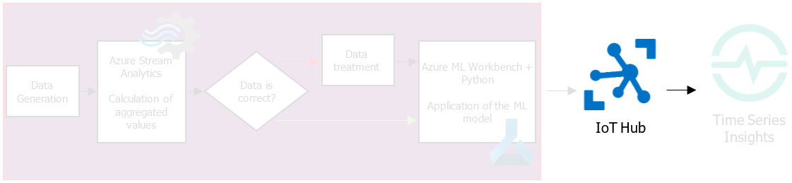
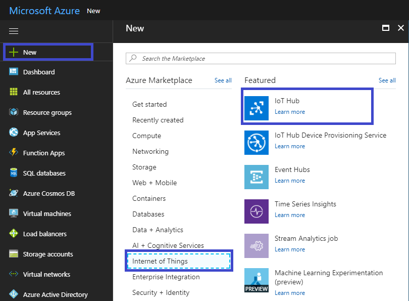
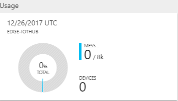

## Create an IoT Hub

1. Sign in to the Azure portal.

2. Select **New -> Internet of Things-> IoT Hub**.

   

3. Complete all fields to create IoT Hub:

   · Name;

   · Pricing level and scaling;

   · Resource group;

   · Location.

   

4. Click **Create**. Creation of IoT Hub might take a few minutes.

   

   You can monitor the progress in the **Notifications** pane.

   In the menu Overview of IoT Hub you can monitor quantity of received messages from the device. In the free version, there are 8000 messages and only one connected device are available.

   

