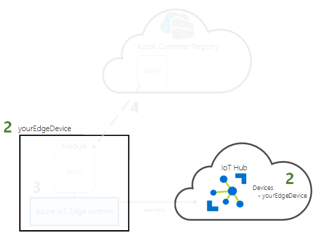
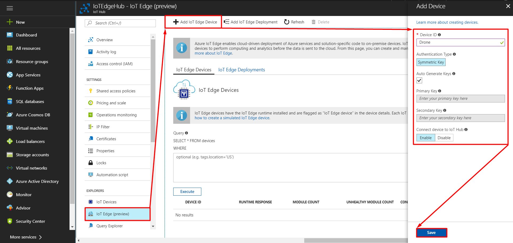

## Register an IoT Edge Device

In the [previous lab](/Lab%201%20-%20Create%20an%20IoT%20Hub) we have created an IoT Hub. In this lab, we will register an IoT Edge Device.

1. In the Azure portal, navigate to your IoT hub, select **IoT Edge (preview)** then select **Add IoT Edge Device**.

2. Set the name and save your Edge Device.

   

3. Select your new device from the list of devices and save the value **Connection string — primary key**.

   

Learn in the [next lab](/Lab%203%20-%20Configure%20an%20IoT%20Edge%20runtime) how to configure an IoT Edge runtime.