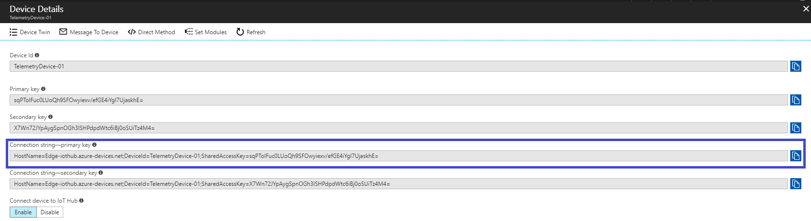

## Register an IoT Edge Device

1. In the Azure portal, navigate toyour IoT hub, select **IoT Edge (preview)**then select **Add IoT Edge Device**.
2. Set the name and save your EdgeDevice.

 

**3.     **Select your new device from the listof devices and save the value **Connection string—primary key**.

** **

