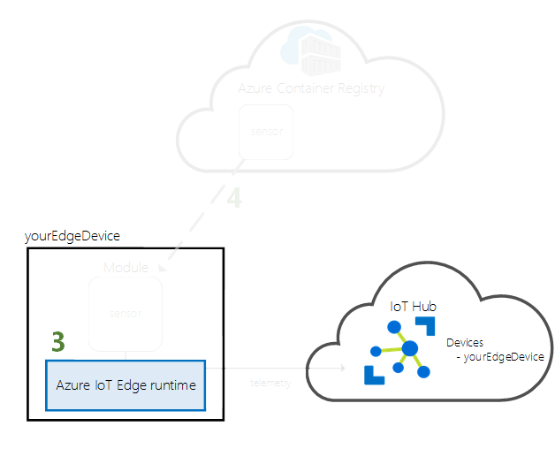
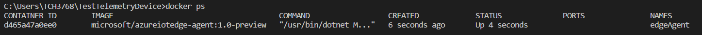
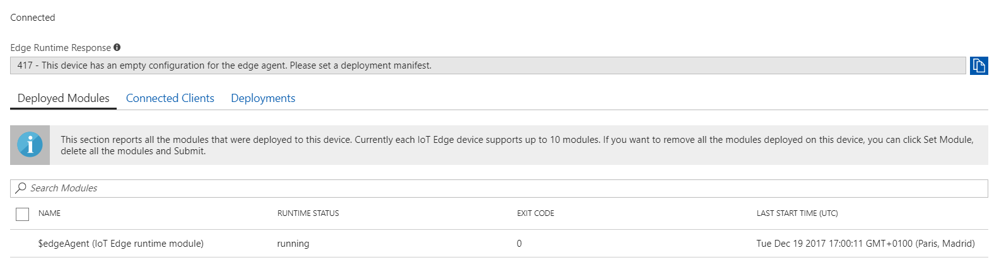

## Configure an IoT Edge runtime

In the [previous lab](/Lab%202%20-%20Register%20an%20IoT%20Edge%20Device) we have registered an IoT Edge Device. In this lab we will see how to configure an IoT Edge runtime.

 

The IoT Edge runtime is deployed on all IoT Edge devices. It comprises two modules. The IoT Edge agent facilitates deployment and monitoring of modules on the IoT Edge device. The IoT Edge hub manages communications between modules on the IoT Edge device, and between the device and IoT Hub. When you configure the runtime on your new device, only the IoT Edge agent will start at first. The IoT Edge Hub comes later when you deploy a module.

 

1. Configure the runtime with your IoT Edge device connection string from the previous section.

   `iotedgectl setup --connection-string "{device connection string}" --auto-cert-gen-force-no-passwords`

2. Start the runtime

   `iotedgectl start`

3. Check Docker to see that the IoTEdge agent is running as a module by cmd or in Azure portal:

   3.1. Using cmd:

   `docker ps`

   

   ​

   3.2. In Azure portal on device's page:

   

Now everything is ready to [create and deploy a first module](/Lab%204%20-%20Create%20and%20deploy%20a%20module%20which%20will%20generate%20telemetry%20data) which will generate the telemetry data.