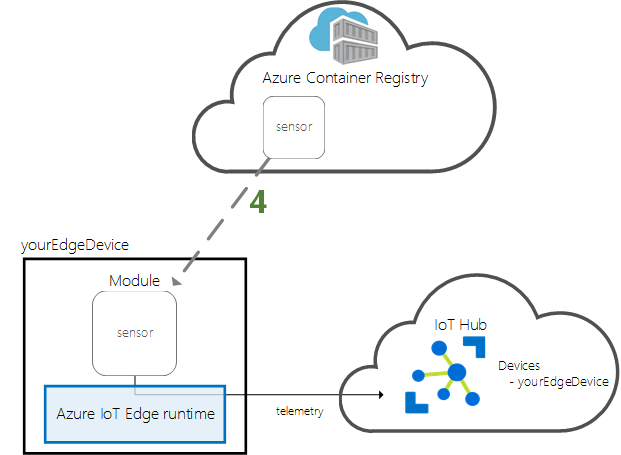
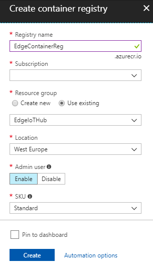
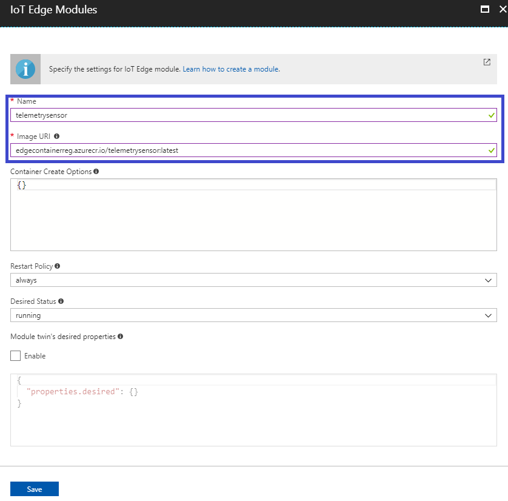
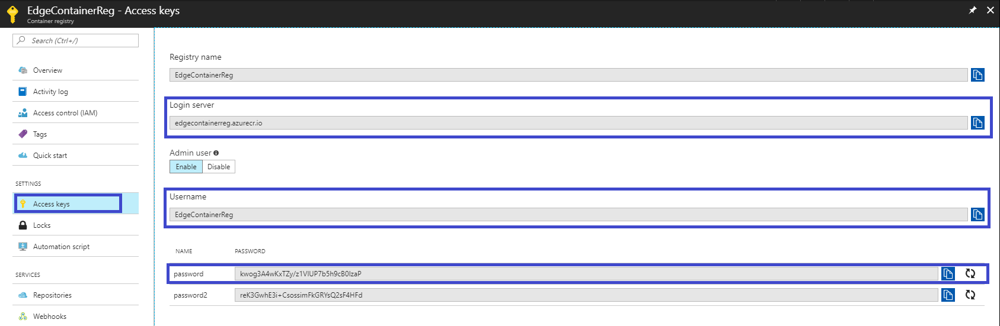
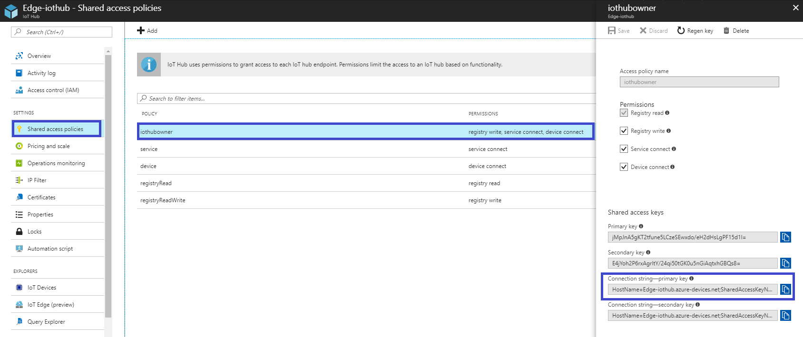
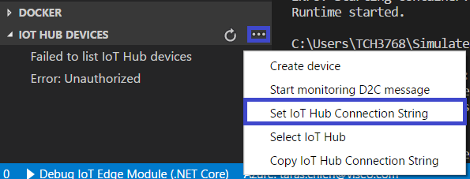
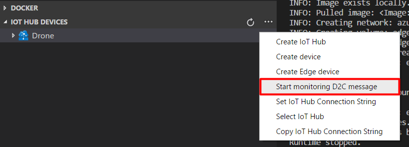
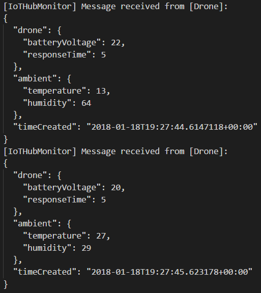
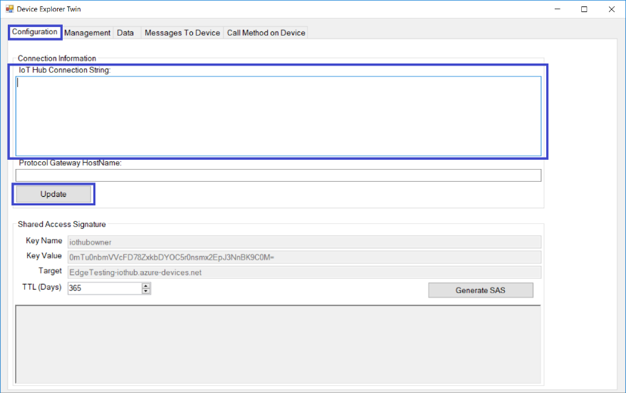
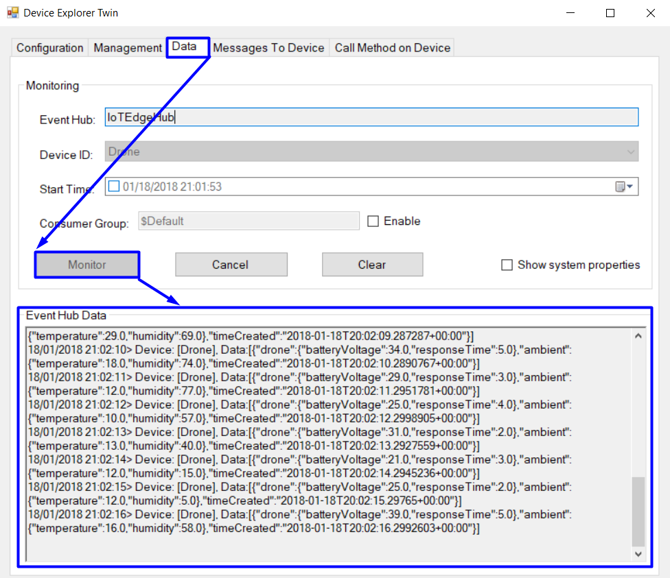

## Create and deploy a module which will send telemetry data


[The previous lab](/Lab%203%20-%20Configure%20an%20IoT%20Edge%20runtime) describes the process of configuring of an IoT Edge runtime. This lab is about creating and deploying of a module generating the telemetry data.

**Objective:** Simulate a device which will generate telemetry data (temperature and pressure of machine, temperature and humidity of ambient and time of data generation) and send it to IoT Hub.





1. In Visual Studio Code, select **View ->Integrated Terminal** to open the integrated terminal.

2. In the integrated terminal, enter the following command to install the **AzureIoTEdgeModule** template in dotnet:

   `dotnet new -i Microsoft.Azure.IoT.Edge.Module`

3. Create a project for the new module by executing a command:

   `dotnet new aziotedgemodule -n {project name}`

4. Select **File** -> **Open Folder** and open created project. This is preconfigured module IoT Edge.

5. Add the next statement :

      ```c#
          using Newtonsoft.Json;
      ```

      ​

6. Add classes Machine, Ambient and MessageBody with needed parameters.

      ```c#
      class MessageBody
      {
        public Machine drone { get; set; }
        public Ambient ambient { get; set; }
        public DateTime timeCreated { get; set; } = DateTime.Now;
      }
      class Machine
      {
        public double batteryVoltage { get; set; }
        public double responseTime { get; set; }         
      }
      class Ambient
      {
        public double temperature { get; set; }
        public double humidity { get; set; }         
      }
      ```


6. Create a new method which will generate telemetry data. This method takes object **DeviceClient** in entry, code create et configure this object in the method **Init**. This object allows the module to connect to the runtime Azure IoT Edge for send and receive messages. The connection string used in the **Init** method is provided for the module by the runtime IoT Edge.

   ```c#
   static async Task<MessageResponse> SendDeviceToCloudMessagesAsync(DeviceClient userContext)
   {

     Random rand = new Random();

     DeviceClient deviceClient = (DeviceClient)userContext;

     while (true)
     {                
       double currentBatteryVoltage = rand.Next(20, 40);
       double currentResponseTime = rand.Next(2, 6); 
       double currentAmbientTemperature = rand.Next(10, 30);
       double currentHumidity = rand.Next(5, 80);

       MessageBody messageBody = new MessageBody();
       
       Machine drone = new Machine();
       drone.batteryVoltage = currentBatteryVoltage;
       drone.responseTime = currentResponseTime;

       Ambient ambient = new Ambient();
       ambient.temperature = currentAmbientTemperature;
       ambient.humidity = currentHumidity;

       messageBody.ambient = ambient;
       messageBody.drone = drone;

       var messageString = JsonConvert.SerializeObject(messageBody);
       var message = new Message(Encoding.ASCII.GetBytes(messageString));

       await deviceClient.SendEventAsync("output1", message);

       await Task.Delay(1000);
     }
     
   }
   ```


7. In the method **Init**, after creation of **DeviceClient** and initialization of client, code has a call for receiving messages from hub IoT Edge by input named **input1**. Replace this call

   ```c#
   await ioTHubModuleClient.SetInputMessageHandlerAsync("input1", PipeMessage, ioTHubModuleClient);
   ```

   by call of a new created method

   ```c#
   await SendDeviceToCloudMessagesAsync(ioTHubModuleClient);
   ```


8. Delete the method **PipeMessage** as no longer usable.

9. For build the project, right clickin **.csproj** file in Explorer and click **Build IoT Edge module**. This process compiles the module and exports the binary and its dependencies into a folder that is used to create a Docker image.

   


10. In Azure portal, create a **Container registry** and fill all fields.

  


11. In VS Code explorer, expand the **Docker** folder. Then expand the folder for your container platform, either **linux-x64** or **windows-nano**. Right-click the **Dockerfile** you need and click **Build IoT Edge module Docker image**.

    


12. In the **Select Folder** window, either browse to or enter `./bin/Debug/netcoreapp2.0/publish` and click **Select Folder as EXE_DIR**.

13. In the pop-up text box at the top of the VS Code window, enter the image name - `edgecontainerreg.azurecr.io/telemetrysensor:latest` (in format: `<yourcontainer registry address> /repository:tag`).

14. Sign in to Docker by entering thefollowing command in the VS Code integrated terminal:

    `docker login -u <username> -p <password> <Loginserver>`

    


15. Push the image to your Docker repository. Select **View ->Command Palette** and search for the **Edge: Push IoT Edge module Docker image** menu command. Enter the image name in the pop-up text box at the top of the VS Code window. Use the same image name you used instep 13.

16. To connect your module to device, in Azure portal navigate to your IoT Hub, go to **IoT Edge (preview)** and open details of your device and click **Set Modules**, on the opened page select **Add IoT Edge Module**.

    


17. Set the name and image URI used in step 13. Then click **Save**.

    


18. Click **Next**. In the Specify routes step, select **Next**, rest default routes:

    ```json
    {
    	"routes": {
    		"route": "FROM /* INTO $upstream"
    	}
    }
    ```

    Then click **Next**, then – **Submit**.


19. Add the credentials for your registry to the Edge runtime on the computer where you are running your Edge device. These credentials give the runtime access to pull the container.

    `iotedgectl login --address <your container registry address> --username <username> --password <password>`

    


20. Check the messages being sent from the module to the IoT Hub via **VS Code**:

   - Right-click on **IoT Hub Devices** and click **Set IoT Hub Connection String**.

     

   - In the pop-up text box at the top of the VS Code window, enter **Connection string —primary key** of the IoT Hub.

     

   - Click **Start monitoring D2C message**.

     

   - Check data in **VS Code** output.

     


21. Or you can do the same using **Device Explorer Twin**:

   - Set **Connection string—primary key** of the IoT Hub et click **Update**.

     

   - Check connected device.

     

   - Click **Monitor** and check output data.

     

     ​


[The next lab](/Lab%205%20-%20Create%20and%20deploy%20a%20Stream%20Analytics%20module) explains how to create a module that can contain Azure service such as Azure Stream Analytics.