## Create and deploy a Stream Analytics module


[The previous lab](/Lab%204%20-%20Create%20and%20deploy%20a%20module%20which%20will%20generate%20telemetry%20data) describes how to create and deploy a module which sends a telemetry data every second. In this lab, we will use an Azure Stream Analytics module to get an aggregated values. 


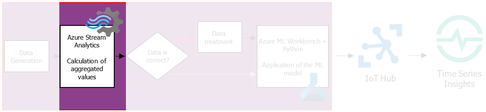


1. In the Azure portal, go to **New** -> **Storage**, and then select **Storage account - blob, file, table, queue**.

   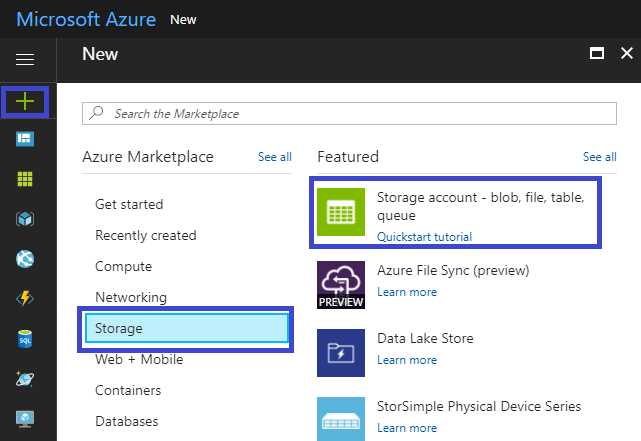


2. In the **Create storage account** pane, enter a name for your storage account,select the same location where your IoT hub is stored, and then select **Create**. Note the name for later use.

   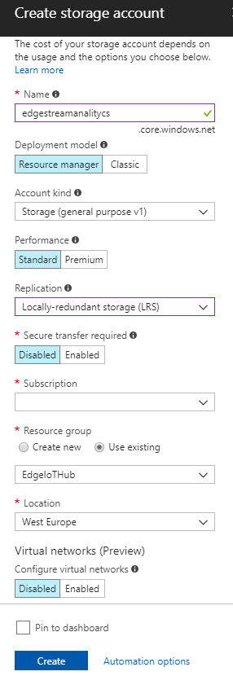


3. Go to the storage account that you just created, and then select **Containers.** Create a new container for the Azure Stream Analytics module to store data, set the access level to **Container**, and then select **OK**.

   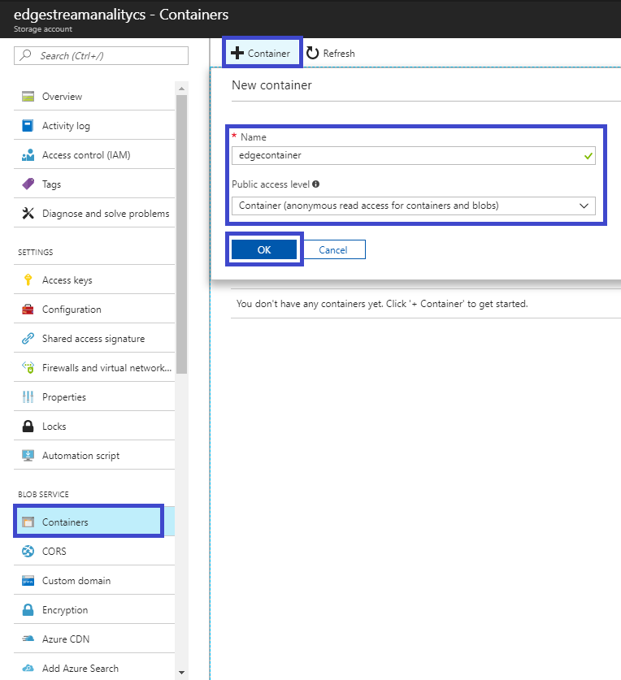


4. In the Azure portal, go to **New** -> **Internet of Things**, and then select **Stream Analytics Job**.

5. In the **New Stream Analytics Job** pane, set name, group and location for the job, select **Edge** like **Hosting environment**. Select **Create**.

   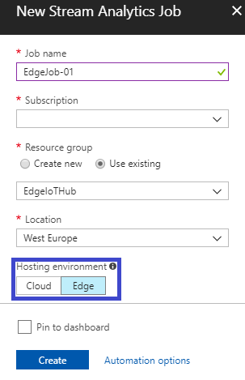


6. In the created job, under **Job Topology** select **Inputs** -> **Add**. In the **New input** pane, set the **Input alias** and set **Data stream** for **Source Type**. Other – by default.

   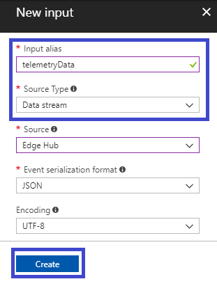


7. In the created job,under **Job Topology** select **Outputs** -> **Add**. In the **New output** pane, set the **Output alias**. Other – by default.

   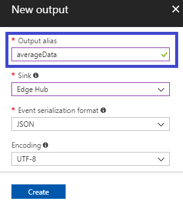


8. In the created job, under **Job Topology** select **Query** and replace the default query with following: 

   ```sql
   SELECT
       Avg(drone.batteryVoltage) as m_avg_battery_v, Avg(drone.responseTime) as m_avg_resp_time
       , Avg(ambient.humidity) as a_avg_hum, Avg(ambient.temperature) as a_avg_temp
       , Max(timeCreated) as timeCreated
   INTO
       averageData
   FROM
       telemetryData TIMESTAMP BY timeCreated 
   GROUP BY TumblingWindow(second,10)
   ```


9. Save the query.

10. In the Azure portal, in your IoT hub, go to **IoT Edge (preview)**, and then open the details page for your IoT Edge device. To add your Azure Stream Analytics Edge job, select **Set Modules** -> **Import Azure Stream Analytics IoT Edge Module**.

11. Choose your subscription, created job and **Storage account** with **Container** created on steps 2-3.

    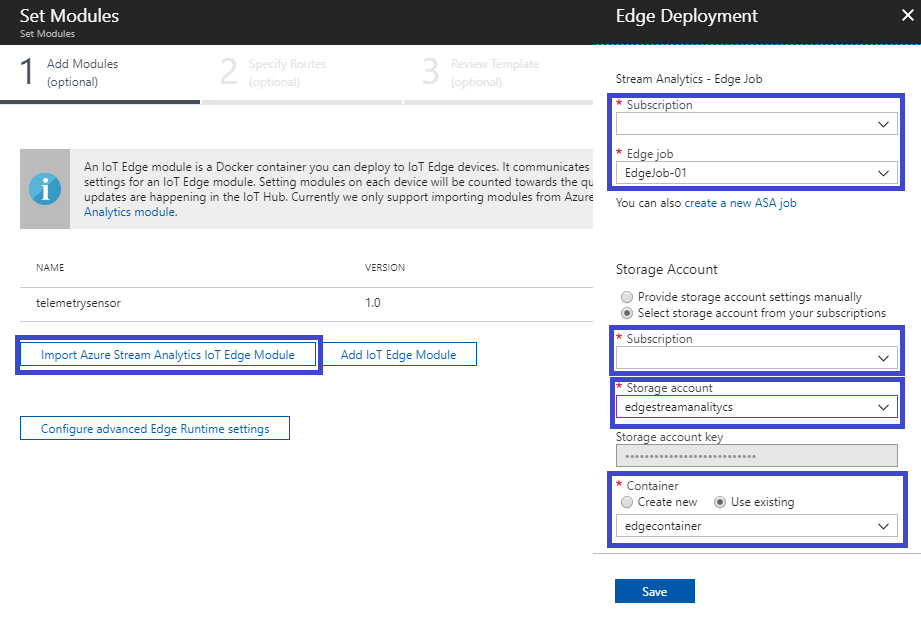


12. Click **Next** and set routes for passing telemetry data from first module to Stream Analytics:

    ```json
    {
    	"routes": {
    		"telemetryToAsa": "FROM/messages/modules/telemetrysensor/* INTO BrokeredEndpoint(\"/modules/EdgeJob-01/inputs/telemetryData\")",
      		"AsaToHub": "FROM/messages/modules/EdgeJob-01/outputs/averageData INTO $upstream" 
      	}
    }
    ```


13. Check output data like for the first module.

    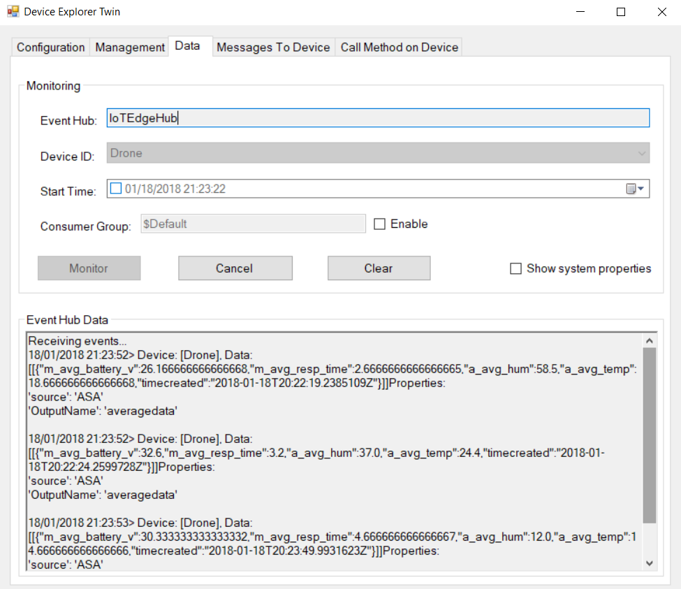


 	Or, in VS Code terminal execute the command to get inputs (blue) of Stream Analytics Job and and the corresponding outputs (red)


	`docker logs -f EdgeJob-01`

 	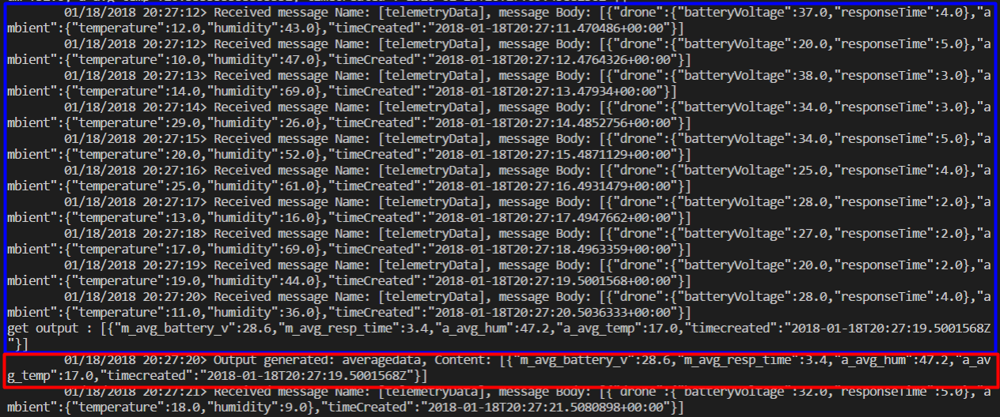


 	In the same time, you can see a JSON output via D2C messages

 	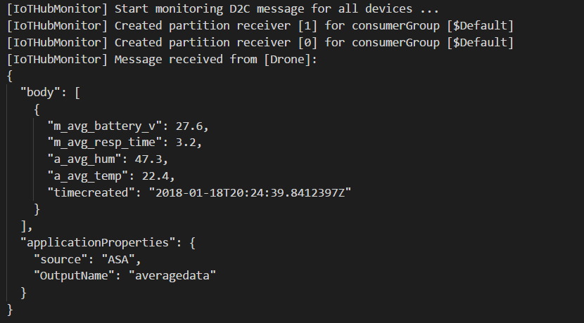


Go to [next lab](/Lab%206%20-%20Create%20and%20deploy%20a%20process%20data%20module) to see how create and deploy a custom logic module which will process the aggregated data. 