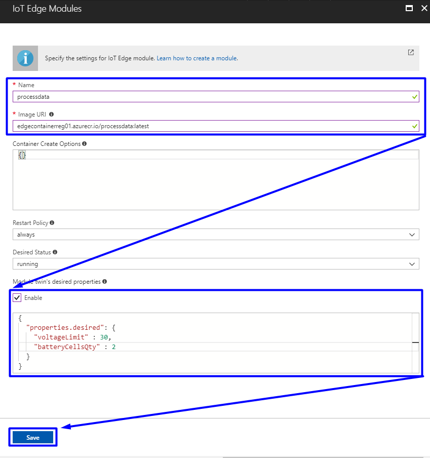
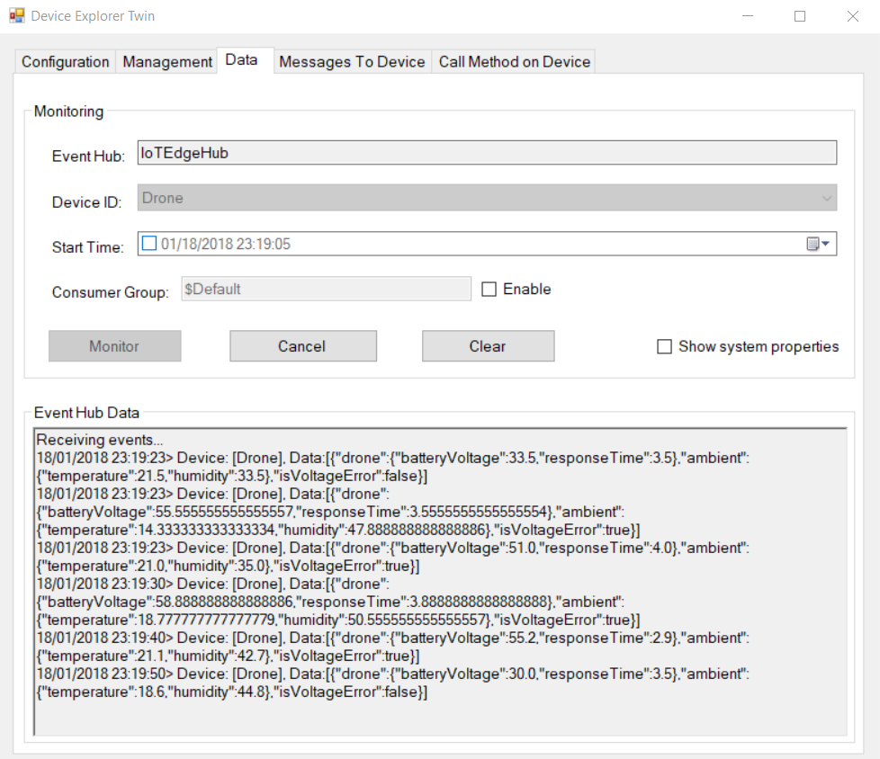

## Create and deploy a process data module


[The previous lab](/Lab%205%20-%20Create%20and%20deploy%20a%20Stream%20Analytics%20module) contains the process of creation a Stream Analytics module for IoT Edge runtime. In the following lab we will create a new C# module which will filter data from Azure Stream Analytics and return the same structure of output like a first module of simulated device. This module will take two parameters the default values for which you can set from Azure portal:

· **voltageLimit** – if input battery voltage is less than this value we will multiply input battery voltage by quantity of battery cells (see a second parameter);

· **batteryCellsQty** – for multiply input voltage.

Filter module described below can be useful in case when some sensor send an incorrect data or did not send anything due to a connection issue as an incorrect value can be replaced by a predefined value.


1. Create a new IoT Edge module via Visual Studio Code (detailed description of how this can be done can be found [here](/Lab%204%20-%20Create%20and%20deploy%20a%20module%20which%20will%20generate%20telemetry%20data)).

2. Add the next statements:

   ```c#
       using Microsoft.Azure.Devices.Shared;
       using Newtonsoft.Json;
   ```

   ​

3. Add classes **Machine**, **Ambient** and **MessageBody**, same then for simulated device, but with parameter **isVoltageError** for greater visibility. Add **ReceivedMessage** class which describe structure of output from Stream Analytics Job.

   ```c#
    class ReceivedMessage 
    {
      public double m_avg_battery_v { get; set; }
      public double m_avg_resp_time { get; set; }
      public double a_avg_temp { get; set; }
      public double a_avg_hum { get; set; }
      public DateTime timeCreated { get; set; }
    }

   class MessageBody
   {
     public Machine drone { get; set; }
     public Ambient ambient { get; set; }
     public bool isVoltageError { get; set; }
   }
   class Machine
   {
     public double batteryVoltage { get; set; }
     public double responseTime { get; set; }         
   }
   class Ambient
   {
     public double temperature { get; set; }
     public double humidity { get; set; }         
   }
   ```

4. Add two parameters in a class Program.

   ```c#
   static int voltageLimit { get; set; } = 20;
   static int batteryCellsQty { get; set; } = 4;
   ```

5. Add method **onDesiredPropertiesUpdate** which will reinitialize values **voltageLimit** and **batteryCellsQty**. Key idea here is to get a value if it is specified in Azure portal by user ; if not, use predefined values from step 3.

   ```c#
   static Task onDesiredPropertiesUpdate(TwinCollection desiredProperties, object userContext)
   {
     try
     {
       Console.WriteLine("Desired property change:");
       Console.WriteLine(JsonConvert.SerializeObject(desiredProperties));

       if (desiredProperties["voltageLimit"] != null)
         voltageLimit = desiredProperties["voltageLimit"];

       if (desiredProperties["batteryCellsQty"] != null)
         batteryCellsQty = desiredProperties["batteryCellsQty"];

     }
     catch (AggregateException ex)
     {
       foreach (Exception exception in ex.InnerExceptions)
       {
         Console.WriteLine();
         Console.WriteLine("Error when receiving desired property: {0}", exception);
       }
     }
     catch (Exception ex)
     {
       Console.WriteLine();
       Console.WriteLine("Error when receiving desired property: {0}", ex.Message);
     }
     return Task.CompletedTask;
   }
   ```

6. Add module **ProcessInputDroneMessages** which will process the input data.

   ```c#
   	static async Task<MessageResponse> ProcessInputDroneMessages(Message message, object userContext)
   	{
   		try
   		{
   			DeviceClient deviceClient = (DeviceClient)userContext;

   			byte[] messageBytes = message.GetBytes();
   			string messageString = Encoding.UTF8.GetString(messageBytes);
   			messageString = messageString.Replace("[","").Replace("]","");
   			Console.WriteLine(messageString);

   			// Get message body
   			var receivedMessage = JsonConvert.DeserializeObject<ReceivedMessage>(messageString);

   			MessageBody messageBody = new MessageBody();
   			Machine drone = new Machine();
   			Ambient ambient = new Ambient();

   			if (receivedMessage != null)
   			{
   				string outputRoute = "";
   				bool isIncorrectVoltage = (bool)(receivedMessage.m_avg_battery_v < voltageLimit);

   				if (isIncorrectVoltage == true)
   				{
   					messageBody.isVoltageError = true;
   					drone.batteryVoltage = receivedMessage.m_avg_battery_v * batteryCellsQty;
   					outputRoute = "output1";
   				}
   				else
   				{
   					messageBody.isVoltageError = false;
   					drone.batteryVoltage = receivedMessage.m_avg_battery_v;
   					outputRoute = "output2";
   				}

   				drone.responseTime = receivedMessage.m_avg_resp_time;
   				ambient.temperature = receivedMessage.a_avg_temp;
   				ambient.humidity = receivedMessage.a_avg_hum;

   				messageBody.ambient = ambient;
   				messageBody.drone = drone;
   				

   				var processedMessageString = JsonConvert.SerializeObject(messageBody);
   				var processedMessage = new Message(Encoding.ASCII.GetBytes(processedMessageString));

   				await deviceClient.SendEventAsync(outputRoute, processedMessage);

   			}

   			// Indicate that the message treatment is completed
   			return MessageResponse.Completed;
   		}
   		catch (AggregateException ex)
   		{
   			foreach (Exception exception in ex.InnerExceptions)
   			{
   				Console.WriteLine();
   				Console.WriteLine("Error in sample: {0}", exception);
   			}
   			// Indicate that the message treatment is not completed
   			DeviceClient deviceClient = (DeviceClient)userContext;
   			return MessageResponse.Abandoned;
   		}
   		catch (Exception ex)
   		{
   			Console.WriteLine();
   			Console.WriteLine("Error in sample: {0}", ex.Message);
   			// Indicate that the message treatment is not completed
   			DeviceClient deviceClient = (DeviceClient)userContext;
   			return MessageResponse.Abandoned;
   		}
   	}
   }
   ```

   We added two outputs, one for the filtered data, other– non filtered data.

7. In the method **Init** change the line :

   ```c#
   await ioTHubModuleClient.SetImputMessageHandlerAsync("input1", PipeMessage, iotHubModuleClient);
   ```

   by the next lines :

   ```c#
   // Attach callback for Twindesired properties updates
   await ioTHubModuleClient.SetDesiredPropertyUpdateCallbackAsync(onDesiredPropertiesUpdate, null);

   // Register callback to becalled when a message is received by the module
   await ioTHubModuleClient.SetInputMessageHandlerAsync("input1", ProcessInputDroneMessages, ioTHubModuleClient);
   ```


7. Delete the method **PipeMessage** as no longer usable.
8. Build and push a new docker image from this project (for example: `edgecontainerreg.azurecr.io/datafilter:latest`).

9. Add a new module to your Edge device. In the Azure portal navigate to your device, then click **Set Module -> Add IoT Edge Module** and set name, image URI and desired properties JSON.

   


10. Click **Next** and modify routes.

  ```json
  {
    "routes": {
      "telemetryToAsa": "FROM /messages/modules/telemetrysensor/* INTO BrokeredEndpoint(\"/modules/EdgeJob-01/inputs/telemetryData\")",
      "AsaToFiltration": "FROM /messages/modules/EdgeJob-01/outputs/averageData INTO BrokeredEndpoint(\"/modules/processdata/inputs/input1\")",
      "filtrationToIoTHub1": "FROM /messages/modules/processdata/outputs/output1 INTO $upstream",
      "filtrationToIoTHub2": "FROM /messages/modules/processdata/outputs/output2 INTO $upstream"
    }
  }
  ```

  Check the output result data.

  


For now, we have a module which generates a raw data, an Azure Stream Analytics module that converts values to aggregated data and module described above does a data treatment. So, we can now apply a Machine Learning algorithms to unlock data insides. Proceed to [the next lab](/Lab%207%20-%20Setup%20environment%20to%20manage%20Azure%20Machine%20Learning%20models) to setup an environment to manage Azure Machine Learning models.