## Create a Azure Machine Learning model for an IoT Edge module

 

This part describes the process of creating and deploying an Azure Machine Learning module that predicts device failure based on simulated sensor data.

 Azure Machine Learning Services is an advanced analytics and end-to-end Data Science solution that enables data scientists to prepare data, develop experiments and deploy models.

 To start creating the experiment, you have to launch Azure Machine Learning Workbench. When Azure Machine Learning Workbench is started and the user is logged in to Azure account for the first time, the following screen is displayed if the user does not have access to an experiment account yet:

 

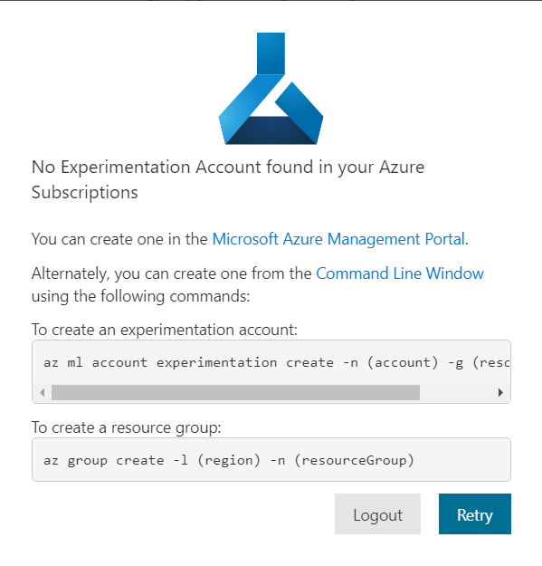

To create **an experimentation account** you have to use the command:

`az ml account experimentation create -n [Experimentation account name] -g [Resource group name]`

To deploy the IoT Edge module containing the Machine Learning model, you need to:

1. Create **a workspace** in the experimentation account

   `az ml workspace create --name [Workspace name] --account[Experimentation account name] --resource-group [Resource group name]`

2.    Create **an empty project**

      `az ml project create --name [Project name] --workspace [Workspace name] --account [Experimentation account name] --resource-group [Resource group name] --path [Local path to the project directory]`

       

3.    Open the project in Azure Machine Learning Workbench

4.    Add the **file with the initial data** to the local project folder

      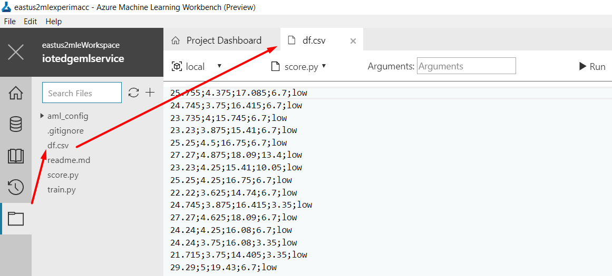

 

5. In the **Data tab**, click the plus sign (+) to add a new data source.

   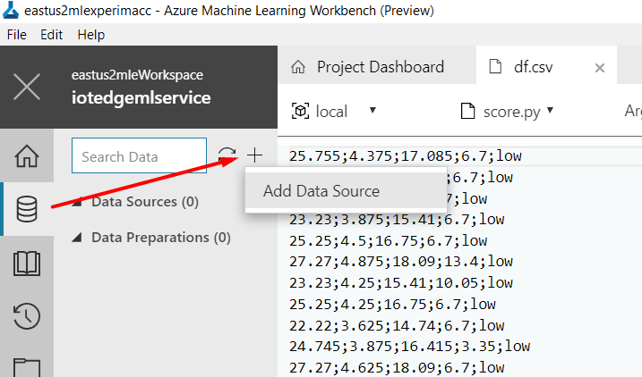

 

6. After selecting the file, select the **Finish** button. A new file named **df.dsource** will be added to the project.

7.    By clicking on **Metrics** it is possible to observe the histograms of the distributions of each of the columns as well as their statistics.

      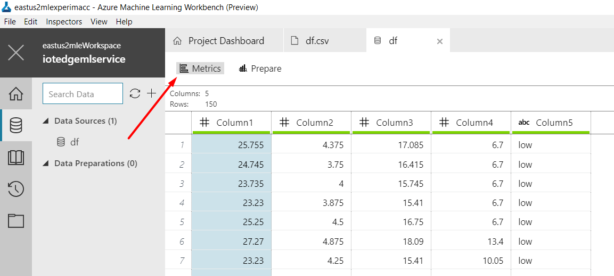

8.     Click the **Prepare** button.

       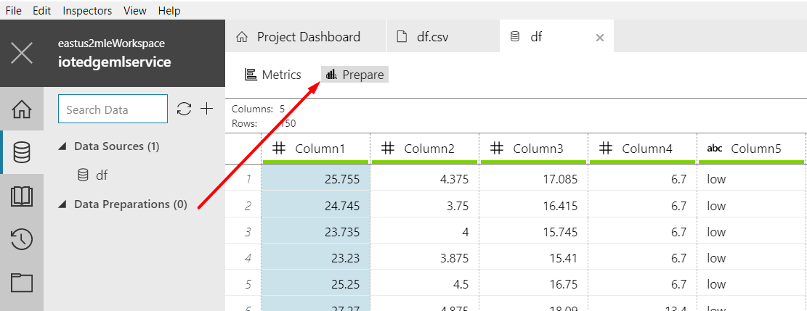

9. Select **+New data preparation package** from the drop-down menu, enter a new value for the package name, and click **OK**.

   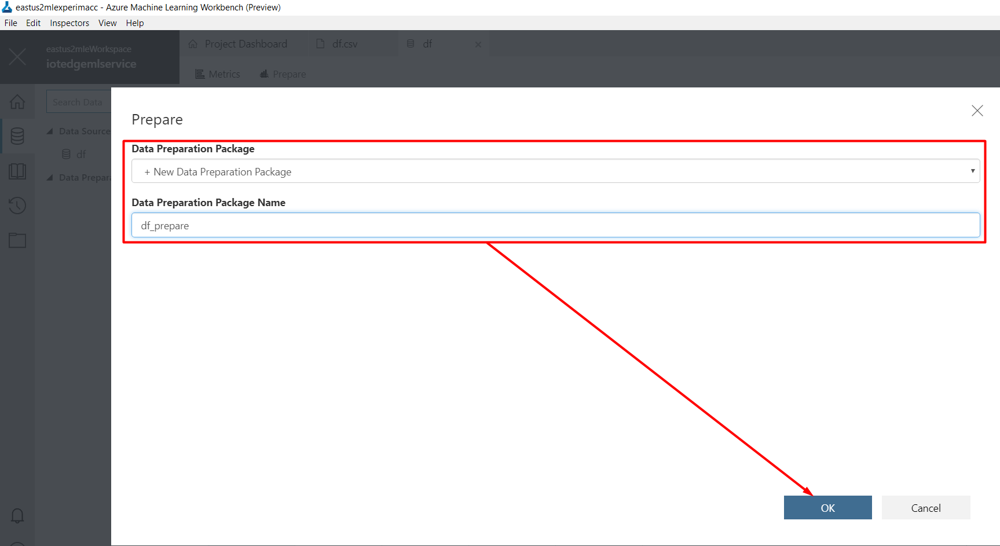


10. Now, data preparation tasks can be realized.

    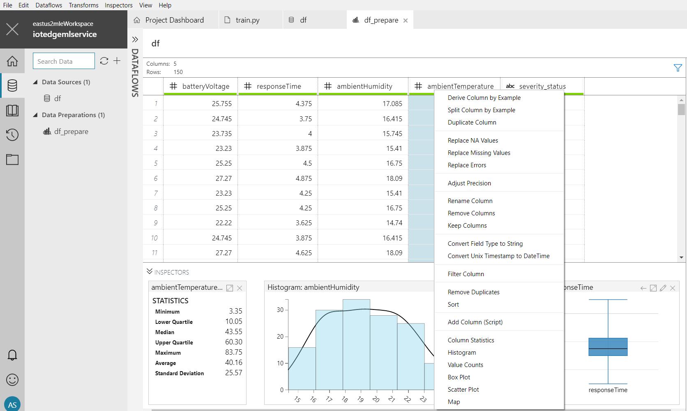

11.   It is important that the individual steps are detailed in the **STEPS** pane. Each action performed is recorded as a data preparation step. It is possible to modify the individual steps to adjust the parameters, rearrange and delete steps.

      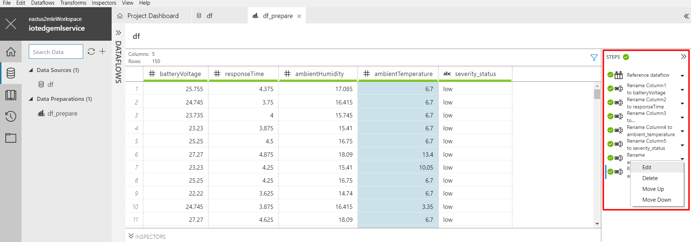

      The work is automatically saved in the file with the extension **.dprep** (see Data Preparation section).

      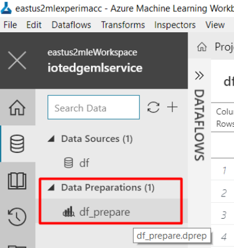 

12.   Select **Files** (the folder icon) in the pane on the left to open the list of files in the project folder. Select the train.py file. Python code opens under a new tab of the text editor in Workbench.

      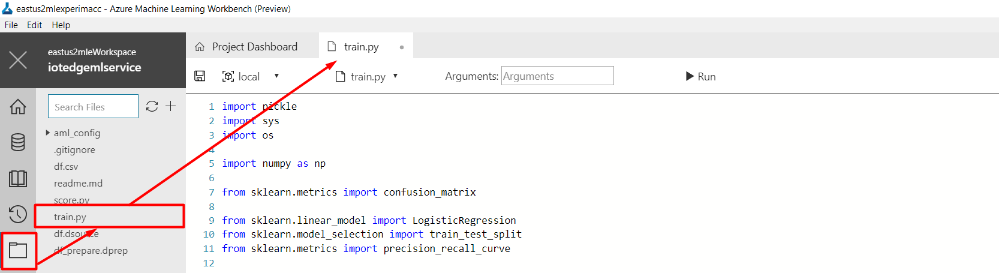

      To create a model, the following python code can be used :

      ``````python
      # Please make sure scikit-learn is included the aml_config/conda_dependencies.yml file.

      # Load necessary libraries
      import pickle
      import sys
      import os

      import numpy as np
      from sklearn.metrics import confusion_matrix

      from sklearn.linear_model import LogisticRegression
      from sklearn.model_selection import train_test_split
      from sklearn.metrics import precision_recall_curve

      from azureml.logging import get_azureml_logger
      from azureml.dataprep.package import run

      # Initialize the logger
      run_logger = get_azureml_logger() 

      # Create the outputs folder where the training results will be stored
      os.makedirs('./outputs', exist_ok=True)

      print('Python version: {}\n'.format(sys.version))

      # Load dataset from a DataPrep package as a pandas DataFrame
      df = run('df.dprep', dataflow_idx=0, spark=False)
      print ('Dataset shape: {}'.format(df.shape))

      # Define the features columns and the label column
      X, Y = df[['machine_temperature', 'machine_pressure', 'ambient_temperature', 'ambient_humidity']].values, df['severity_status'].values

      # Add n more random features to make the problem harder to solve
      # Randomness is required because the df.csv dataset is an example dataset
      # and it is easily ranked with almost 100% accuracy
      # n - number of new random features to add
      n = 17
      random_state = np.random.RandomState(0)
      n_samples, n_features = X.shape
      X = np.c_[X, random_state.randn(n_samples, n)]

      # Split data 70%-30% into training set and test set
      X_train, X_test, Y_train, Y_test = train_test_split(X, Y, test_size=0.3, random_state=0)

      # Obtain the value of the parameter of the regularization, which makes it possible to avoid overfitting
      reg = 0.5
      # Load regularization rate from argument if present
      if len(sys.argv) > 1:
          reg = float(sys.argv[1])

      print("Regularization rate is {}".format(reg))

      # Log the regularization rate
      run_logger.log("Regularization Rate", reg)

      # Train a logistic regression model on the training set
      clf1 = LogisticRegression(C=1/reg).fit(X_train, Y_train)
      print (clf1)

      # Evaluate the test set
      accuracy = clf1.score(X_test, Y_test)
      print ("Accuracy is {}".format(accuracy))

      # Log accuracy
      run_logger.log("Accuracy", accuracy)

      # Calculate and log precesion, recall, and thresholds, which are a list of numerical values
      y_scores = clf1.predict_proba(X_test)
      precision, recall, thresholds = precision_recall_curve(Y_test, y_scores[:,1],pos_label='moderate')
      run_logger.log("Precision", precision)
      run_logger.log("Recall", recall)
      run_logger.log("Thresholds", thresholds)

      print('''
      ==========================================
      Serialize and deserialize using the outputs folder.
      ''')

      # Serialize the model on disk in the special 'outputs' folder
      print ("Export the model to model.pkl")
      f = open('./outputs/model.pkl', 'wb')
      pickle.dump(clf1, f)
      f.close()

      # Load the model back from the 'outputs' folder into memory
      print("Import the model from model.pkl")
      f2 = open('./outputs/model.pkl', 'rb')
      clf2 = pickle.load(f2)

      # Predict on a new sample
      X_new = [[31.6, 4.7, 20.8, 77.7]]
      print ('New sample: {}'.format(X_new))

      # Add random features to match the training data
      X_new_with_random_features = np.c_[X_new, random_state.randn(1, n)]

      # Score on the new sample
      pred = clf2.predict(X_new_with_random_features)
      print('Predicted class is {}'.format(pred))
      ``````

13.   Run the train.py script in a local environment by clicking the **Run** button.

      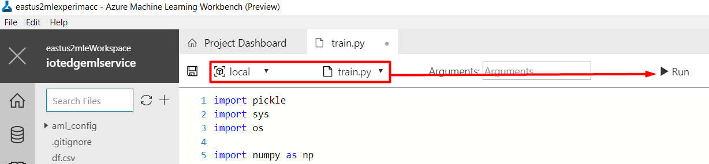

      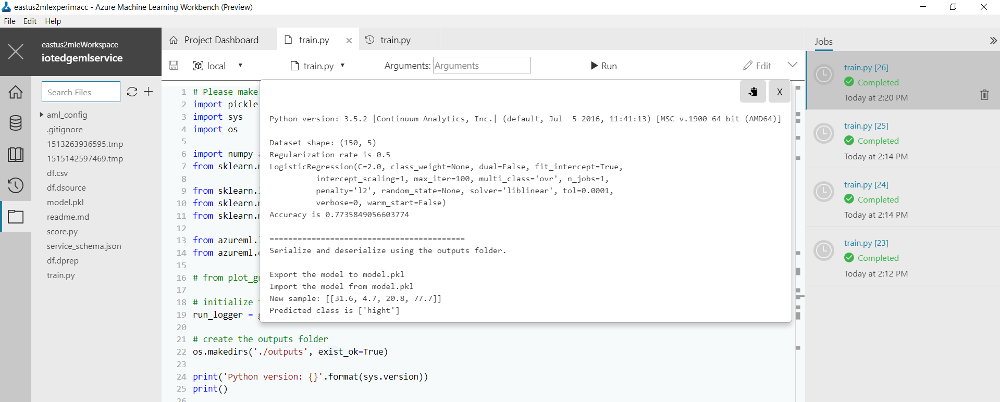

14. In the **Jobs pane**, select blue text train.py [n] (where n is the run number) just above the Completed state and the start time. The Runtime Properties window opens and displays the following information for this particular run:

    •     Runtime Properties Information

    •     Outputs Files

    •     Visualizations, if any

    •     Logs

    It is possible to download the **model file** to create a docker image.

    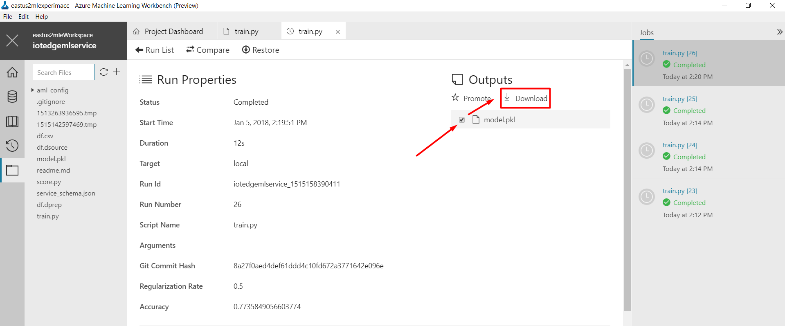

