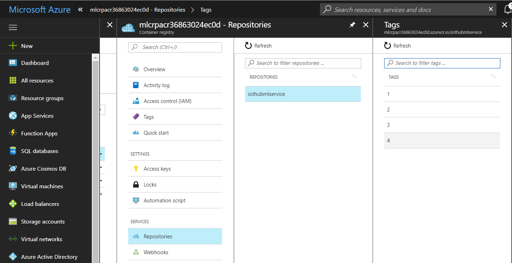
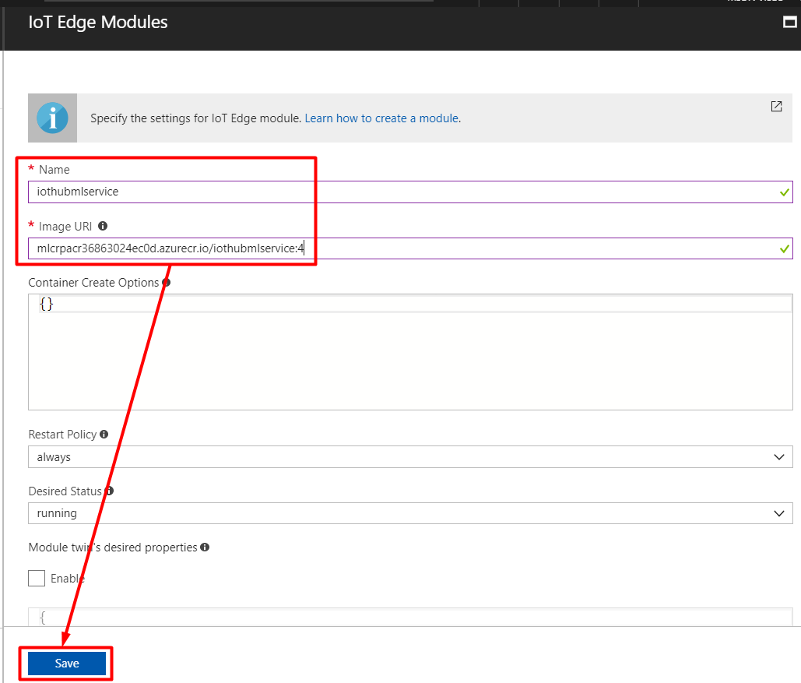
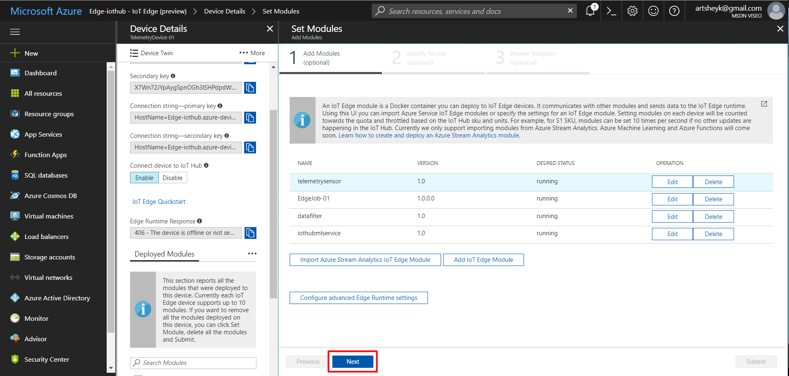
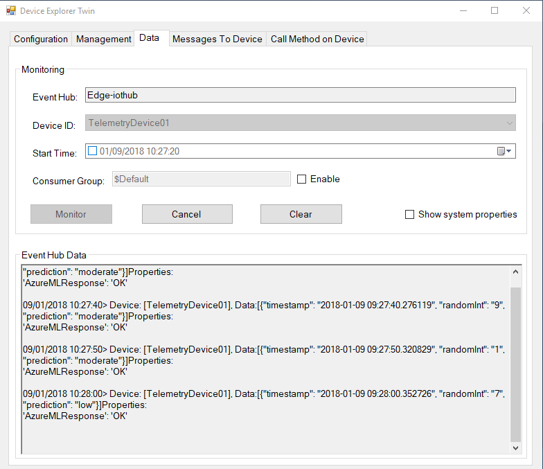
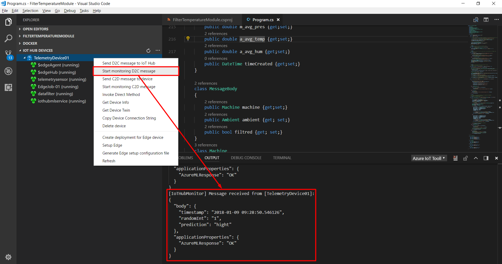

## Deploy an Azure Machine Learning model as an IoT Edge module


To deploy a [previously created model](/Lab%208%20-%20Create%20an%20Azure%20Machine%20Learning%20model%20for%20an%20IoT%20Edge%20module), we need to create a scoring file with init() and run() functions. The following code can be used to create a score.py file:

```python
# This script generates the scoring and schema files,
# creates the schema and holds the init and run functions needed to 
# operationalize the model

# Import data collection library. Only supported for docker mode.
# Functionality will be ignored when package isn't found
try:
    from azureml.datacollector import ModelDataCollector
except ImportError:
    print("Data collection is currently only supported in docker mode. May be disabled for local mode.")
    # Mocking out model data collector functionality
    class ModelDataCollector(object):
        def nop(*args, **kw): pass
        def __getattr__(self, _): return self.nop
        def __init__(self, *args, **kw): return None
    pass

import os

# Format time method 
def ts_to_date(ts):
    import datetime
    return datetime.datetime.fromtimestamp(ts).strftime('%Y-%m-%d %H:%M:%S.%f')

# Prepare the web service definition by authoring init() and run() functions.
# Test the functions before deploying the web service.
def init():
    global inputs_dc, prediction_dc
    from sklearn.externals import joblib

    global model
    model = joblib.load('model.pkl')

    inputs_dc = ModelDataCollector("model.pkl", identifier="inputs")
    prediction_dc = ModelDataCollector("model.pkl", identifier="prediction")

def run(input_str):
    import json
    import time
    import numpy as np
    import pandas as pd
    import random

    input_json = json.loads(input_str)

    input_df = pd.DataFrame([[input_json['machine']['temperature'], \
        input_json['machine']['pressure'], \
        input_json['ambient']['temperature'], \
        input_json['ambient']['humidity'], \
        ]])

    # Append 17 random features just like the training script does it.
    n = 17
    random_state = np.random.RandomState(0)
    n_samples, n_features = input_df.shape
    input_df = np.c_[input_df, random_state.randn(n_samples, n)]
    inputs_dc.collect(input_df)

    pred = model.predict(input_df)
    prediction_dc.collect(pred)

    data = dict(
        prediction = str(pred[0]),
        timestamp = ts_to_date(time.time()),
        randomInt = str(random.randint(0,9))
    )

    return data

def main():
  from azureml.api.schema.dataTypes import DataTypes
  from azureml.api.schema.sampleDefinition import SampleDefinition
  from azureml.api.realtime.services import generate_schema
  import pandas as pd
  import json
  
  df = pd.DataFrame(data=[[31.6, 4.7, 20.8, 77.7]], columns=['machine_temperature', \
   'machine_pressure', 'ambient_temperature', 'ambient_humidity'])

  # Turn on data collection debug mode to view output in stdout
  os.environ["AML_MODEL_DC_DEBUG"] = 'true'

  # Test the output of the functions
  init()
  
  input1 = '{ "machine": { "temperature": 31.6, "pressure": 4.7 }, \
        "ambient": { "temperature": 20.8, "humidity": 77.7 },\
        "timeCreated": "2017-12-27T16:02:09.1933728Z" }'

  print("Result: " + run(input1))
  
  inputs = {"input_df": SampleDefinition(DataTypes.PANDAS, df)}
  
  # Genereate the schema
  generate_schema(run_func=run, inputs=inputs, filepath='./outputs/service_schema.json')
  print("Schema generated")

if __name__ == "__main__":
    main()

```


Now, everything is ready to deploy a model as an IoT Edge module. To do this :

1. To deploy the registered model as a web service.

   `az ml service create realtime --model-file model.pkl -f score.py -n iothubmlservice -r python`

2. To find out how to call the service:

   `az ml serviceusage realtime -i [service id]`

3. Using the run function at the command prompt you can get the call result of the service:

   `az ml servicerun realtime -i [service id] -d "{\"input_df\": [INPUTDATA]}"`

   After creating the service, the model image will be created in the Container registry of the environment.

   


4. The image can be used as the module for the device.

   

   

   


5. In the next step, for the routes we need to put the following :

   ```json
   {
   	"routes": {
   		"telemetryToAsa": "FROM /messages/modules/telemetrysensor/outputs/output1 INTO BrokeredEndpoint(\"/modules/EdgeJob-01/inputs/telemetryData\")",
   		"AsaToFiltration": "FROM /messages/modules/EdgeJob-01/outputs/averageData INTO BrokeredEndpoint(\"/modules/datafilter/inputs/input1\")",
   		"filtrationToMachineLearning1": "FROM /messages/modules/datafilter/outputs/output1 INTO BrokeredEndpoint(\"/modules/iothubmlservice/inputs/amlInput\")",
   		"filtrationToMachineLearning2": "FROM /messages/modules/datafilter/outputs/output2 INTO BrokeredEndpoint(\"/modules/iothubmlservice/inputs/amlInput\")",
   		"machineLearningToIoTHub": "FROM /messages/modules/iothubmlservice/outputs/amlOutput INTO $upstream"
   	}
   }

   ```

   Clicking Submit adds the module to the list and we can see the result of the model work using Visual Studio Code or Device Explorer.

   

   


So, we have a Machine Learning model that finalizes a pipline of modules inside a device and IoT Hub, that stocks all predictions results. Now it's time [to add a powerful visualizing tool to analyze data in near real time](/Lab%2010%20-%20Visualize%20results).