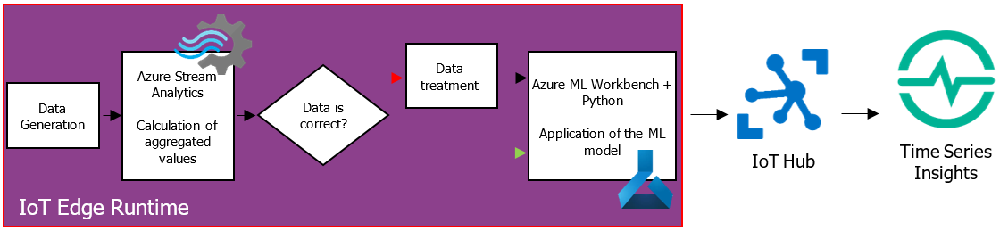
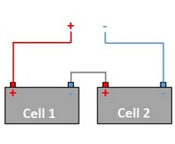

# RedShirtTour-IoT-Edge-AI-Lab
(pour le français, cf. README-FR.md)

<em>Authors : Artem SHEIKO + Taras CHIEN
Contributor : Vincent Thavonekham + Igor Leontiev</em>

Nowadays customers are increasingly looking for ways to obtain insights from all their data. Volume, speed and complexity of data now defeats traditional analytics tools, that’s why more and more customers now realize that traditional approaches in conjunction with Business Intelligence are not enough. While <strong>Business Intelligence</strong> addresses <strong>descriptive</strong> and <strong>diagnostic analysis</strong>, <strong>Data Science</strong> unlocks new opportunities through <strong>predictive</strong> and <strong>prescriptive analysis</strong>. This causes a high demand for solutions using Data Science and Machine Learning in a near-real time that can adapt to a rapidly changing environment, that can work « at the edge » (i.e. directly on the sensors’ side, thanks to “Edge Computing”).

Through various Labs, we are going to focus on an innovative part consisting in working with <strong>devices “at the edge” with Machine Learning processing, in near-real time. All disconnected from the Cloud, but with a Cloud management and supervision</strong> as soon as the connectivity is back.

---
The Labs are based on true example of Drones transporting parcels, but with simplified assumptions to ease the understanding. The Drones has to take decisions real-time based on its sensors, and the telemetry sent to the Cloud will help predict maintenance time.

>image source: https://www.openfogconsortium.org

Here is the overall architecture of the Labs

Learn how to create a custom logic modules, use Azure Stream Analytics and Machine Learning module during IoT Edge Runtime, send information to IoT Hub and visualize the results through Azure Time Series Insights in the first series of Hands-On Labs. In this series, you will see how you can use a simple dataset and Logistic Regression model to predict a severity status of drone’s state. The architecture of the solution is presented below.

Get started quickly with Hands-On Labs :

- [Lab 1 - Create an IoT Hub](/Lab%201%20-%20Create%20an%20IoT%20Hub)
- [Lab 2 - Register an IoT Edge Device](/Lab%202%20-%20Register%20an%20IoT%20Edge%20Device)
- [Lab 3 - Configure an IoT Edge runtime](/Lab%203%20-%20Configure%20an%20IoT%20Edge%20runtime)
- [Lab 4 - Create and deploy a module which will generate telemetry data](/Lab%204%20-%20Create%20and%20deploy%20a%20module%20which%20will%20generate%20telemetry%20data)
- [Lab 5 - Create and deploy a Stream Analytics module](/Lab%205%20-%20Create%20and%20deploy%20a%20Stream%20Analytics%20module)
- [Lab 6 - Create and deploy a process data module](/Lab%206%20-%20Create%20and%20deploy%20a%20process%20data%20module)
- [Lab 7 - Setup environment to manage Azure Machine Learning models](/Lab%207%20-%20Setup%20environment%20to%20manage%20Azure%20Machine%20Learning%20models)
- [Lab 8 - Create an Azure Machine Learning model for an IoT Edge module](/Lab%208%20-%20Create%20an%20Azure%20Machine%20Learning%20model%20for%20an%20IoT%20Edge%20module)
- [Lab 9 - Deploy an Azure Machine Learning model as an IoT Edge module](/Lab%209%20-%20Deploy%20an%20Azure%20Machine%20Learning%20model%20as%20an%20IoT%20Edge%20module)
- [Lab 10 - Visualize results](/Lab%2010%20-%20Visualize%20results)

For more examples discover more examples in [Next Steps](/Red%20Shirt%20Dev%20Tour%20Hands-On%20Lab%202nd%20Series.pdf).

This is Work-In-Progress so new Labs will be added and others will be refined on an on-going basis. 